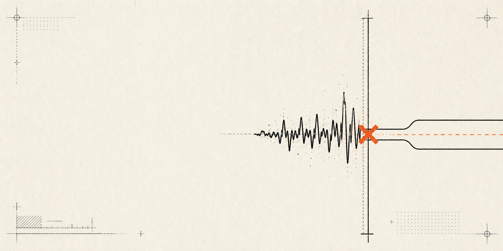
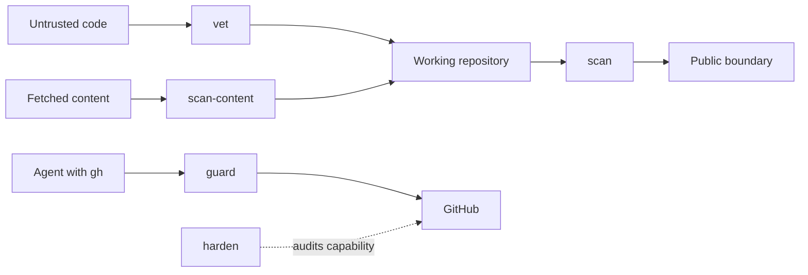

<p align="center">
  
</p>

# agent-security

Deterministic safety gates for repositories touched by coding agents and automation.

`agent-security` checks code on both sides of the trust boundary: material entering your workspace and material leaving it for a public repository. It also trips on known prompt-injection shapes, blocks common destructive `gh` commands until a human confirms the exact repository, and audits whether the active GitHub credential can still delete one.

Every result includes its limit. `CLEAN` means no known pattern matched. It does not mean safe.

[Quickstart](#sixty-second-start) · [Control map](#five-controls-one-boundary) · [Limits](#read-the-boundary-before-the-verdict) · [Blueprints](docs/blueprints.md) · [Security](SECURITY.md)

## Sixty-second start

No package install, account, or network access is needed for the scanners. Clone the repository, then run the gate that matches the job:

```sh
git clone https://github.com/0xNyk/agent-security.git
cd agent-security

# Before publishing your own repository
scripts/scan-repo.sh --all

# Before installing or building someone else's template, plugin, or skill
scripts/vet-incoming.sh ../candidate

# Before an agent processes fetched or pasted content
scripts/scan-content.sh ../fetched-page.txt
```

The core scripts require Bash and Git. Python 3 handles invisible-Unicode checks, hook parsing, and installer JSON edits.

## Five controls, one boundary

| Control | Run it when | Decision |
|---|---|---|
| [`scan`](SKILL.md#scan--leak--dropper-gate) | You are about to publish or push a repository. | Blocks credential shapes, private context, invisible Unicode, and same-file decode-to-exec patterns. |
| [`vet`](SKILL.md#vet--vet-inbound-third-party-code-before-adoption) | You cloned code but have not installed or executed it. | Returns `ADOPT`, `REVIEW`, or `REJECT`; never runs the candidate. |
| [`scan-content`](SKILL.md#scan-content--untrusted-content-tripwire-known-patterns-only) | An agent is about to read fetched, pasted, tool, or MCP output. | Flags known instruction-override, exfiltration, credential-solicitation, and covert-action shapes. |
| [`guard`](SKILL.md#guard-install--repository-lifecycle-guard) | An agent or automation can call GitHub CLI. | Stops destructive repository operations until repo-specific confirmation is present. |
| [`harden`](SKILL.md#harden--audit-the-real-destructive-capability-surface) | You need to know what the active GitHub credential and policy can destroy. | Reports `OK`, `HIGH`, or `UNKNOWN` without changing GitHub. |



## Protect destructive GitHub operations

Install the local CLI brake, add the optional Claude Code hook, then inspect the result:

```sh
scripts/repo-guard-install.sh --with-hook --setup-path
scripts/repo-guard-install.sh --status
scripts/harden-check.sh --offline
```

Run `scripts/harden-check.sh` without `--offline` for best-effort organization-policy and branch-protection checks. The command is read-only.

The guard is deliberately repo-specific. Rename, transfer, delete, archive, and visibility changes remain blocked until the operator supplies the confirmation described in [destructive-operations prevention](references/destructive-ops-prevention.md).

## Read the boundary before the verdict

These tools are Tier 1 tripwires: early, deterministic, and explainable. They do not replace code review, least privilege, provenance checks, or server-side policy.

- `scan` and `vet` match patterns within one file. They cannot follow a payload decoded in one file and executed in another. Use CodeQL or another taint-analysis tool for that path.
- Secret matches are shapes, not provider-verified credentials.
- `scan-content` is easy to evade with new wording, encoding, translation, or instructions split across lines. Treat fetched content as data and restrict agent capabilities.
- The `gh` guard is a local brake. An unguarded binary or direct API client can bypass it. Token permissions and organization policy are the durable controls.
- `harden` returns `UNKNOWN` when capability cannot be inspected. Unknown is not clear.

The [coverage matrix and bypass table](references/coverage-and-limits.md) state what each detector sees, misses, and delegates to a stronger control.

## Configuration

Private names and paths belong in a local marker file that never enters the repository. Installation, marker setup, command options, and removal steps are documented in [references/install.md](references/install.md).

The project does not collect telemetry or send scanned content anywhere. URL-based inbound vetting performs a shallow clone into a temporary directory; local vetting and repository scans are network-free.

## Verify the project

The fixture suites create dangerous-looking examples only inside temporary repositories. They do not execute payloads or call external services.

```sh
for test in test-scan test-vet test-harden test-scan-content test-guard self-scan; do
  bash "tests/$test.sh" || exit 1
done

shellcheck -S warning scripts/*.sh scripts/repo-guard/*.sh tests/*.sh
gitleaks git --no-banner --redact .
```

Detector changes need a positive fixture, a neighboring clean fixture, and a written limit. Read [CONTRIBUTING.md](CONTRIBUTING.md) before proposing one. Send exploitable bypasses through the private route in [SECURITY.md](SECURITY.md); use [SUPPORT.md](SUPPORT.md) for ordinary questions.

## Status and license

Experimental, maintained as capacity permits, and released under the [MIT License](LICENSE). The current release line is `0.1.x`. Release checks live in [RELEASE.md](RELEASE.md); engineering decisions and visual provenance live in the [field notes](docs/field-notes.md) and [brand guide](docs/brand.md).
