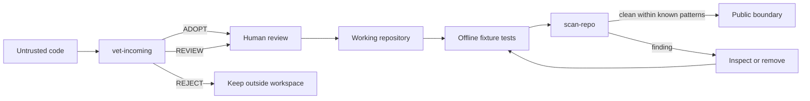
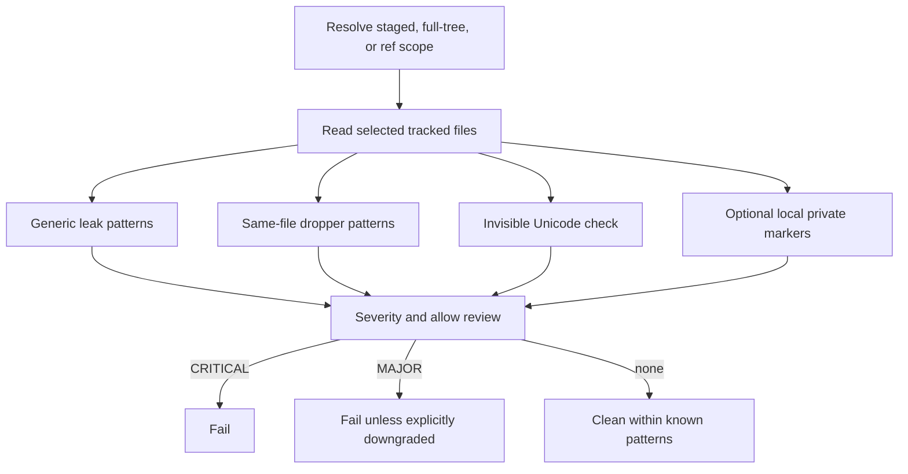
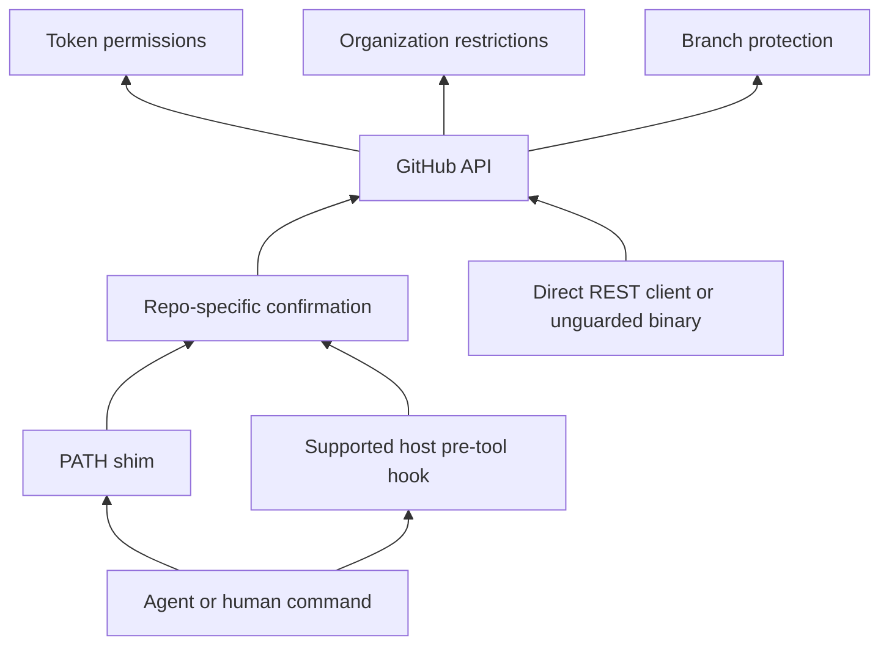
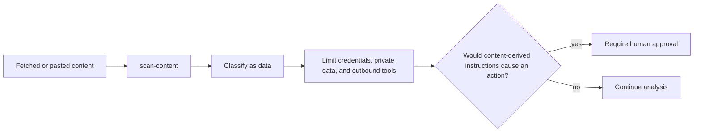

# Technical blueprints

These diagrams describe control flow and authority. They are kept in Mermaid so labels remain searchable and changes remain reviewable.

## Repository boundary

The publish arrow does not mean safe. It means the known-pattern gate and project tests passed.

## Scanner pipeline

Private markers remain outside the repository. The generic layer runs when no marker file exists and prints that limitation.

## Destructive-operation control stack

The shim and hook are bypassable brakes. Token, organization, and branch controls are server-side boundaries.

## Untrusted-content handling

Detection supports this flow but does not enforce it. The behavioral contract lives in [untrusted content](../references/untrusted-content.md).

